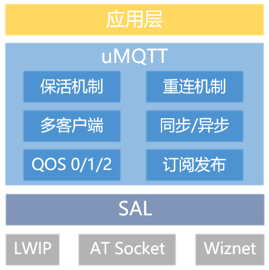

# uMQTT

## 1. Introduction

The uMQTT software package is an MQTT 3.1.1 protocol client implementation independently developed by RT-Thread. It provides basic functions for device communication with MQTT Broker.

uMQTT software package features:

* Implements basic connection, subscription, and publish functions
* Features multiple heartbeat keep-alive and device reconnection mechanisms to ensure MQTT online status and adapt to complex scenarios
* Supports QoS=0, QoS=1, and QoS=2 three message quality levels
* Supports multiple client usage
* User-friendly interface with multiple callback functions
* Supports multiple configurable technical parameters, easy to use and suitable for product development
* Powerful functionality, low resource consumption, and supports function customization

Resource consumption (test environment W60X):

| ROM | RAM | Dynamic RAM |
| :-: | :-: | :-: |
| 12.97KByte | 0.01KByte | 4.9KByte |

### 1.1 Directory Structure

```
umqtt
├───docs                                // Documentation
├───inc
│   ├───umqtt_internal.h                // Internal packing and transmission header file
│   ├───umqtt_cfg.h                     // Structure configuration header file
│   └───umqtt.h                         // External interface header file
├───src
│   ├───pkgs                            // Customized porting of paho_embedded library
│   │   ├───umqtt_pkgs_decode.c         // Unpacking implementation source file
│   │   ├───umqtt_pkgs_encode.c         // Packing implementation source file
│   ├───trans
│   │   └───umqtt_trans.c               // Transport layer source file
│   └───umqtt_utils.c                   // Common interface implementation file
├───samples                             // Finsh debug interface examples
├───tests                               // Test cases
├───LICENSE                             // Software package license
├───README.md                           // Software package usage documentation
└───SConscript                          // RT-Thread default build script
```

### 1.2 License

The uMQTT software package complies with the Apache-2.0 license. See the LICENSE file for details.

### 1.3 Dependencies

- RT-Thread 3.0+
- SAL component

## 2. Getting the Software Package

**uMQTT software package configuration options**
```
--- umqtt: A MQTT Client for RT-Thread
[ ]   Enable MQTT example
[ ]   Enable MQTT test
(4)   subtopic name list numbers
(1024) send buffer size
(1024) receive buffer size
(1000) uplink timer def cycle, uint:mSec
(5)   reconnect max count
(60)  reconnect time interval, uint:Sec
(5)   keepalive func, max count
(30)  heartbeat interval, uint:Sec
(4)   connect timeout, uint:Sec
(100) receive timeout, uint:mSec
(4)   send timeout, uint:Sec
(4096) receive thread stack size
(8)   thread priority
(4)   async message ack queue count
(0xFFFF) connect information, keepalive interval, uint:Sec
[ ]   Enable change connect keepalive time, uint:Sec
    Version (latest)  --->
```

* subtopic name list numbers: Maximum number of simultaneous subscriptions
* send buffer size: Send data buffer size
* receive buffer size: Receive data buffer size
* uplink timer def cycle, uint:mSec: Timer running cycle, unit: mSec
* reconnect max count: Maximum reconnection attempts
* reconnect time interval, uint:Sec: Reconnection interval, unit: Sec
* keepalive func, max count: Heartbeat reconnection count in keep-alive mechanism
* heartbeat interval, uint:Sec: Heartbeat transmission interval, unit: Sec
* connect timeout, uint:Sec: Connection timeout, unit: Sec
* receive timeout, uint:mSec: Receive timeout, unit: mSec
* send timeout, uint:Sec: Send timeout, unit: Sec
* receive thread stack size: Internal receive thread stack
* thread priority: Internal thread priority
* async message ack queue size: Message queue size for receive thread to send processing results
* connect information, keepalive interval, uint:Sec: KEEPALIVE value in MQTT CONNECT command, default maximum 0xFF, unit: Sec
* Enable change connect keepalive time, uint:Sec: Allow modification of keepalive time in MQTT connection information, unit: Sec
* Version: Software version number

## 3. Using uMQTT Software Package

### 3.1 Software Package Working Principle

The uMQTT software package is mainly used to implement the MQTT protocol on embedded devices. The software package layered diagram is as follows:

  

The main implementations during software development include:

1. Based on MQTT 3.1.1 protocol specifications, implement data protocol packing and unpacking

2. Adapt transport layer functions to the SAL layer

3. uMQTT client layer implements application-level interfaces based on protocol and transport layers. Supports basic connection, disconnection, subscription, unsubscription, and message publishing functions. Supports QoS0/1/2 three message quality levels. Utilizes uplink timer to implement multiple heartbeat keep-alive and device reconnection mechanisms, improving device online stability and adapting to complex scenarios.

### 3.2 User API Introduction

#### 3.2.1 Create Object
```c
umqtt_client_t umqtt_create(const struct umqtt_info *info);
```
Create a client structure object.

| Parameter | Description |
|:----------|:-----------|
| info | User information configuration |
| **Return Value** | **Description** |
| != RT_NULL | uMQTT client structure pointer |
| == RT_NULL | Creation failed |

#### 3.2.2 Delete Object
```c
int umqtt_delete(struct umqtt_client *client);
```
Delete the client structure object and release memory.

| Parameter | Description |
|:----------|:-----------|
| client | uMQTT client structure pointer |
| **Return Value** | **Description** |
| UMQTT_OK | Success |

#### 3.2.3 Start Client
```c
int umqtt_start(struct umqtt_client *client);
```
Start the client session, establish network connection and MQTT protocol connection.

| Parameter | Description |
|:----------|:-----------|
| client | uMQTT client structure pointer |
| **Return Value** | **Description** |
| >=0 | Success |
| <0 | Failure |

#### 3.2.4 Stop Client
```c
void umqtt_stop(struct umqtt_client *client);
```
Stop the client session, close the receive thread, pause the uplink timer, send MQTT disconnect command, and close the socket.

| Parameter | Description |
|:----------|:-----------|
| client | uMQTT client structure pointer |
| **Return Value** | **Description** |
| None | None |

#### 3.2.5 Publish Message
```c
int umqtt_publish(struct umqtt_client *client, enum umqtt_qos qos, const char *topic, void *payload, size_t length, int timeout);
```
Publish messages with corresponding quality level to subscribed topics.

| Parameter | Description |
|:----------|:-----------|
| client | uMQTT client structure pointer |
| qos | Message transmission quality level |
| topic | Publish topic |
| payload | Publish message |
| length | Publish message length |
| timeout | Publish message timeout, unit: mSec |
| **Return Value** | **Description** |
| >=0 | Success |
| <0 | Failure |

#### 3.2.6 Subscribe Topic
```c
int umqtt_subscribe(struct umqtt_client *client, const char *topic, enum umqtt_qos qos, umqtt_subscribe_cb callback);
```
Subscribe to a topic and set the callback function for receiving publish messages on that topic.

| Parameter | Description |
|:----------|:-----------|
| client | uMQTT client structure pointer |
| topic | Subscribe topic |
| qos | Subscription quality level |
| callback | Callback function for receiving publish messages on the topic |
| **Return Value** | **Description** |
| >=0 | Success |
| <0 | Failure |

#### 3.2.7 Unsubscribe Topic
```c
int umqtt_unsubscribe(struct umqtt_client *client, const char *topic);
```
Unsubscribe from a topic and release related resources.

| Parameter | Description |
|:----------|:-----------|
| client | uMQTT client structure pointer |
| topic | Unsubscribe topic |
| **Return Value** | **Description** |
| >=0 | Success |
| <0 | Failure |

#### 3.2.8 Asynchronous Message Publishing
```c
int umqtt_publish_async(struct umqtt_client *client, enum umqtt_qos qos, const char *topic, void *payload, size_t length);
```
Asynchronously publish messages without waiting for acknowledgment.

| Parameter | Description |
|:----------|:-----------|
| client | uMQTT client structure pointer |
| qos | Message transmission quality level |
| topic | Topic for the message |
| payload | Message to publish |
| length | Message length |
| **Return Value** | **Description** |
| >=0 | Success |
| <0 | Failure |

#### 3.2.9 Set/Get Parameters
```c
int umqtt_control(struct umqtt_client *client, enum umqtt_cmd cmd, void *params);
```
Set or read internal parameters based on the command.

| Parameter | Description |
|:----------|:-----------|
| client | uMQTT client structure pointer |
| cmd | Set or read internal parameters |
| params | When setting data, returns structure; when reading data, pass RT_NULL |
| **Return Value** | **Description** |
| >=0 | Success when setting; specific return data when reading |
| >0 | Failure when setting; specific return data when reading |

### 3.3 Example Introduction

#### 3.3.1 Preparation

- Configure the software package and example code with menuconfig

    Use the ENV tool provided by RT-Thread and run **menuconfig** to configure the software package.
    Enable the UMQTT software package and the test example (`Enable MQTT example`) as shown below:

``` shell
RT-Thread online packages
    IoT - internet of things  --->
      [*] umqtt: A MQTT Client for RT-Thread.  --->
        [*] Enable MQTT example                     # Enable UMQTT example
```

- Use `pkgs --update` command to download the software package
- Compile and download
- Use [emqx](https://www.emqx.io/) to set up an MQTT Broker

#### 3.3.2 Running Examples

* Start the uMQTT client

Start uMQTT client process:
- Declare a `struct umqtt_info` structure variable as the uMQTT client user configuration variable
- Assign the test MQTT Broker URI
- Create uMQTT client
- Declare and set connection, online, offline, and heartbeat callback functions
- Call `umqtt_start()` function to start the uMQTT client

```shell
msh />umqtt_ex_start
[D/umqtt.sample]  umqtt example start!
[I/umqtt]  connect success!
[I/umqtt.sample]  umqtt start success!
```

* Subscribe function

```shell
msh />umqtt_ex_subscribe "test0"
[D/umqtt.sample]  umqtt example subscribe!
[D/umqtt]  start assign datas !
[D/umqtt] subscribe ack ok!
```

* Publish message

```shell
msh />umqtt_ex_publish test 0 hello                     # Message quality qos0
[D/umqtt.sample]  umqtt example publish!
[D/umqtt.sample]  umqtt topic recv callback! name length: 4, name: testhello, packet id: 0, payload len: 6

msh />umqtt_ex_publish test 1 hello_this                # Message quality qos1
[D/umqtt.sample]  umqtt example publish!
[D/umqtt.sample]  umqtt topic recv callback! name length: 4, name: test, packet id: 1, payload len: 11
[I/umqtt]  publish qos1 ack success!

msh />umqtt_ex_publish test 1 hello_this_world          # Message quality qos2
[D/umqtt.sample]  umqtt example publish!
[D/umqtt.sample]  umqtt topic recv callback! name length: 4, name: test, packet id: 2, payload len: 17
[I/umqtt]  publish qos2 ack success!
```

* Unsubscribe

```shell
msh />umqtt_ex_unsubscribe test
[D/umqtt.sample]  umqtt example unsubscribe!
[I/umqtt]  unsubscribe ack ok!
```

* Stop the uMQTT client

```shell
msh />umqtt_ex_stop
[D/umqtt.sample]  umqtt example stop!
```

## 4. Notes

* This version does not support encrypted communication protocols
* Use [emqx](https://www.emqx.io/) to set up an MQTT Broker

## 5. Contact & Acknowledgments

Contact: springcity
Email: caochunchen@rt-thread.com

