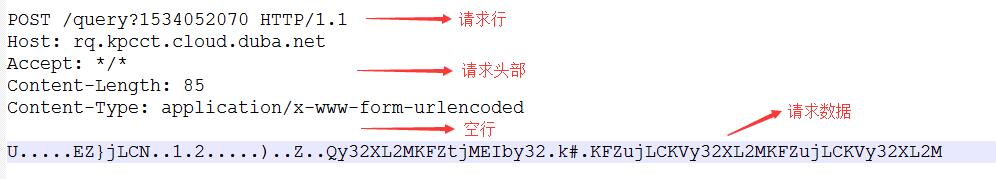
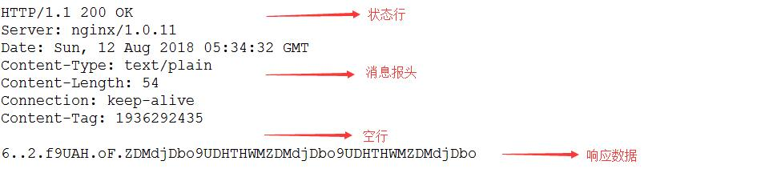

# Software Package Introduction

WebClient is a self-developed HTTP client implementation by RT-Thread that provides basic communication functionality between devices and HTTP servers.

## Software Package Directory Structure

The WebClient software package directory structure is as follows:

```shell
webclient
+---docs 
│   +---figures                     // Documentation images
│   │   api.md                      // API usage documentation
│   │   introduction.md             // Introduction document
│   │   principle.md                // Implementation principles
│   │   README.md                   // Documentation structure
│   │   samples.md                  // Package examples
│   │   user-guide.md               // User guide
│   +---version.md                  // Version
+---inc                             // Header files
+---src                             // Source files
+---samples                         // Sample code
│   │   webclient_get_sample        // GET request sample code
│   +---webclient_post_sample       // POST request sample code
│   LICENSE                         // Software license
│   README.md                       // Package usage documentation
+---SConscript                      // RT-Thread default build script
```

## Software Package Features

WebClient software package features:

- IPv4/IPv6 address support

    WebClient automatically determines whether the URI address format is IPv4 or IPv6, parses the necessary connection information, and improves code compatibility.

- GET/POST request methods support

    HTTP has multiple request methods (GET, POST, PUT, DELETE, etc.). Currently, WebClient supports GET and POST methods, which are the most commonly used command types for embedded devices, meeting development requirements.

- File upload and download functionality

    WebClient provides interface functions for file upload and download, allowing users to directly upload local files to the server or download server files locally via GET/POST methods. File operations require file system support; enable and complete file system porting before use.

- HTTPS encrypted transmission support

    HTTPS (HyperText Transfer Protocol over Secure Socket Layer) is implemented based on TCP like HTTP. It adds a TLS encryption layer to the original HTTP data for secure transmission. HTTPS addresses differ from HTTP addresses by starting with `https`. WebClient's TLS encryption depends on the [mbedtls package](https://github.com/RT-Thread-packages/mbedtls).

- Comprehensive HTTP header handling

    HTTP headers determine request/response data and status information. Adding headers to GET/POST requests is challenging for users. WebClient provides a simple way to add request headers. For response headers, WebClient provides a `method to retrieve field data by field name`, facilitating data retrieval.

## HTTP Protocol Introduction

### HTTP Protocol Overview

HTTP (Hypertext Transfer Protocol) is the most widely used network protocol on the Internet. Due to its simplicity and speed, it is suitable for distributed and collaborative hypermedia information systems. HTTP is a network application layer protocol based on TCP/IP. The default port is 80. The latest version is HTTP 2.0, while HTTP 1.1 is currently most widely used.

HTTP is a request/response protocol. After a client establishes a connection with a server, it sends a request. The server receives the request, determines the response method based on the received information, and sends an appropriate response, completing the HTTP data exchange process.

Web browsers are the primary use case for HTTP, but HTTP is not limited to web applications. Any communication following HTTP protocol standards can exchange data, such as embedded devices communicating with servers via HTTP.

### HTTP Protocol Characteristics

- Stateless protocol

    HTTP is a `stateless protocol`. Statelessness means the protocol has no memory of event handling. If subsequent processing requires previous information, it must be retransmitted, which may increase data transmission per connection. The advantage is faster server responses when prior information is not needed.

- Flexible data transmission

    HTTP allows transmission of any data type, identified by Content-Type.

- Simple and fast

    When a client sends a request to a server, it only needs to transmit the request method and path. HTTP's simplicity results in small server programs and fast communication speeds.

- Supports B/S and C/S models

    C/S (Client/Server) and B/S (Browser/Server) structures.

### HTTP Request Message

A client's HTTP request message to a server consists of four parts: **request line**, **request headers**, **blank line**, and **request body**.

- Request line: Specifies the request type, resource to access, and HTTP version used.

- Request headers: Follows the request line, providing additional information for the server.

- Blank line: Required after headers to separate headers from body.

- Request body: Contains additional data, also called the message body.

The following shows a POST request message:



### HTTP Response Message

Generally, after receiving and processing a client request, the server returns an HTTP response message. An HTTP response consists of four parts: **status line**, **response headers**, **blank line**, and **response body**.

- Status line: Composed of HTTP protocol version (HTTP 1.1), response status code (200), and status message (OK).

- Response headers: Provides additional information for the client (date, content length, etc.).

- Blank line: Required after headers to separate headers from body.

- Response body: Text information returned by the server to the client.

The following shows a POST response message:



### HTTP Status Codes

HTTP uses status codes to indicate response status. WebClient provides methods to retrieve and determine status. Common status code meanings are introduced here.

Status codes consist of three digits. The first digit defines the response category, divided into five types:

- 1xx: Informational--request received, continue processing

- 2xx: Success--request received, understood, and accepted

- 3xx: Redirection--further action required to complete the request

- 4xx: Client error--request has syntax error or cannot be fulfilled

- 5xx: Server error--server failed to fulfill a valid request

Common status codes:

```c 
200 OK                        // Request successful
206 Partial Content           // Server successfully processed partial GET request
400 Bad Request               // Request has syntax error, not understood by server
403 Forbidden                 // Server received request but refuses to serve
404 Not Found                 // Requested resource not found, e.g., incorrect URL
500 Internal Server Error     // Unexpected server error
503 Server Unavailable        // Server cannot process request at this time
```