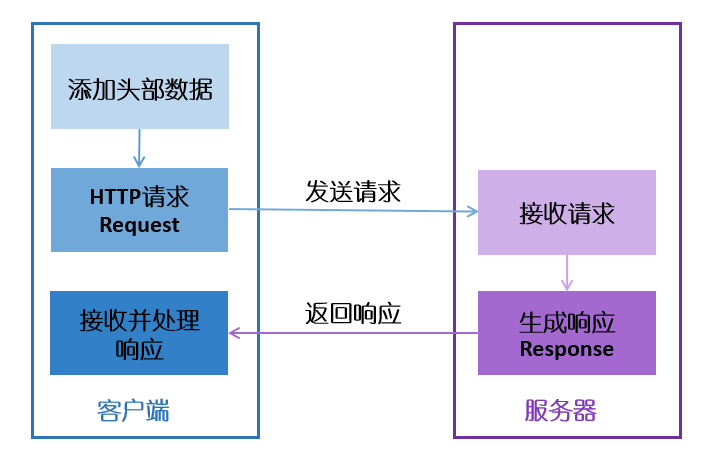

# Working Principle

The WebClient package is primarily used to implement the HTTP protocol on embedded devices. The main working principle of the package is based on the HTTP protocol implementation, as shown in the following diagram:

The HTTP protocol defines how clients request data from servers and how servers transmit data to clients. The HTTP protocol uses a `request/response model`. The client sends a request message to the server, which contains the request method, URL, protocol version, request headers, and request data. The server responds with a status line, which includes the protocol version, success or error code, server information, response headers, and response data.

In practical use of the HTTP protocol, the following process is generally followed:

1. Client connects to the server

    Usually through TCP three-way handshake to establish a TCP connection. The default HTTP port number is 80.

2. Client sends HTTP request (GET/POST)

    Through TCP socket, the client sends a text request message to the web server. A request message consists of four parts: request line, request headers, blank line, and request data.

3. Server receives request and returns HTTP response

    The server parses the request and locates the requested resource. The server writes the resource to be sent to the TCP socket, where the client reads it. A response consists of four parts: status line, response headers, blank line, and response data.

4. Client and server close the connection

    If the connection mode between client and server is normal mode, the server actively closes the TCP connection and the client passively closes it, releasing the TCP connection. If the connection mode is keepalive mode, the connection is maintained for a period of time during which data can continue to be received.

5. Client parses the response data

    After obtaining the data, the client should first parse the response status code to determine if the request was successful, then parse the response headers line by line to obtain response data information, and finally read the response data to complete the entire HTTP data transmission and reception process.

