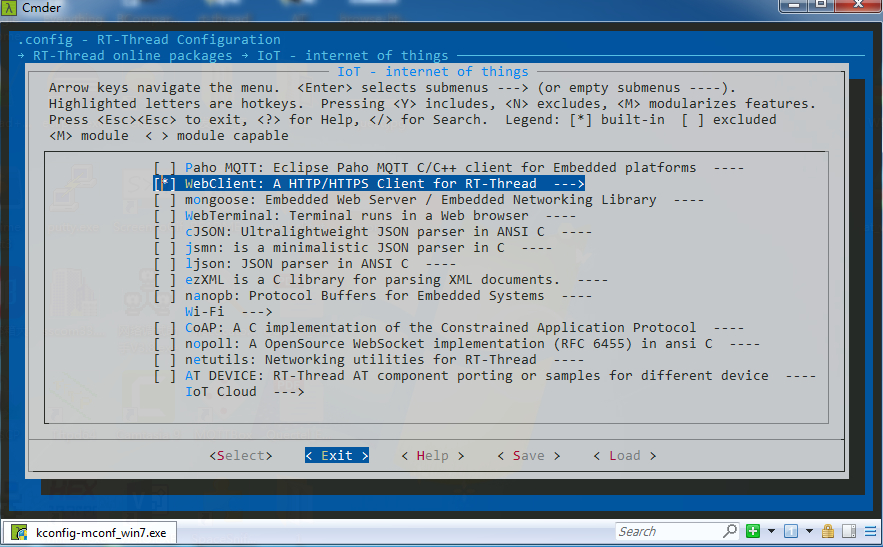

# User Guide

This section mainly introduces the basic usage process of the WebClient package and provides a brief explanation of the structures and important APIs frequently involved in the usage process.

## Preparation

First, you need to download the WebClient package and add it to your project. Use the menuconfig command in the BSP directory to open the env configuration interface. Select the WebClient package in `RT-Thread online packages → IoT - internet of things` as shown in the following figure:



Detailed configuration instructions are as follows:

```shell
RT-Thread online packages
    IoT - internet of things  --->
         [*] WebClient: A HTTP/HTTPS Client for RT-Thread
         [ ]   Enable debug log output
         [ ]   Enable webclient GET/POST samples
               Select TLS mode (Not support)  --->
                   (x) Not support
                   ( ) SAL TLS support
                   ( ) MbedTLS support
              Version (latest)  --->
```

**Enable debug log output**: Enable debug log display to view request and response header information.

**Enable webclient GET/POST samples**: Add sample code.

**Select TLS mode**: Configure HTTPS support and select the supported mode.

- **Not support**: TLS functionality is not supported.
- **SAL TLS support**: Configure TLS functionality support in the SAL component. The SAL component abstracts TLS operations, and users need to **manually configure and enable the TLS package type to be used** (currently only supports MbedTLS package).
- **MbedTLS support**: Configure MbedTLS functionality support.

**Version**: Configure the package version number.

After selecting appropriate configuration items, use the `pkgs --update` command to download the package and update the user configuration.

## Usage Process

Using the WebClient package to send GET/POST requests generally requires completing the following basic steps:

(1) **Create a client session structure**

```c
struct  webclient_header
{
    char *buffer;                       // Header data to be added or retrieved
    size_t length;                      // Current header data length

    size_t size;                        // Maximum supported header data length
};

struct webclient_session
{
    struct webclient_header *header;    // Header information structure
    int socket;                         // Current connection socket
    int resp_status;                    // Response status code

    char *host;                         // Server address for connection
    char *req_url;                      // Request address for connection

    int chunk_sz;                       // Chunk size in chunk mode
    int chunk_offset;                   // Remaining data size in chunk mode

    int content_length;                 // Current received data length (non-chunk mode)
    size_t content_remainder;           // Current remaining received data length

    rt_bool_t is_tls;                   // Whether the current connection is HTTPS
#ifdef WEBCLIENT_USING_MBED_TLS
    MbedTLSSession *tls_session;        // HTTPS protocol session structure
#endif
};
```

The `webclient_session` structure is used to store information about the established HTTP connection and can be used throughout the HTTP data interaction process. Before establishing an HTTP connection, you need to create and initialize this structure. An example creation method is as follows:

```c
struct webclient_session *session = RT_NULL;

/* create webclient session and set header response size */
session = webclient_session_create(1024);
if (session == RT_NULL)
{
    ret = -RT_ENOMEM;
    goto __exit;
}
```

(2) **Concatenate header data**

The WebClient package provides two request header sending methods:

- Default header data

    If you want to use the default header information, you don't need to concatenate any header data and can directly call the GET send command. Default header data is generally only used for GET requests.

- Custom header data

    Use the `webclient_header_fields_add` function to add custom header information. The added header information is stored in the client session structure and sent when sending GET/POST requests.

Example code for adding headers:

```c
/* Concatenate header information */
webclient_header_fields_add(session, "Content-Length: %d\r\n", strlen(post_data));

webclient_header_fields_add(session, "Content-Type: application/octet-stream\r\n");
```

(3) **Send GET/POST requests**

After header information is added, you can call the `webclient_get` function or `webclient_post` function to send GET/POST request commands. The main operations in the function are as follows:

- Obtain information through the passed URI and establish a TCP connection.

- Send default or concatenated header information.

- Receive and parse the header information of the response data.

- Return error or response status code.

Example code for sending a GET request:

```c
int resp_status = 0;

/* send GET request by default header */
if ((resp_status = webclient_get(session, URI)) != 200)
{
    LOG_E("webclient GET request failed, response(%d) error.", resp_status);
    ret = -RT_ERROR;
    goto __exit;
}
```

(4) **Receive response data**

After sending a GET/POST request, you can use the `webclient_read` function to receive the actual response data. Since the actual response data may be quite long, we typically need to loop to receive response data until all data is received.

The following shows how to loop receive and print response data:

```c
int content_pos = 0;
/* Get the length of the received response data */
int content_length = webclient_content_length_get(session);

/* Loop to receive response data until all data is received */
do
{
    bytes_read = webclient_read(session, buffer, 1024);
    if (bytes_read <= 0)
    {
        break;
    }

    /* Print response data */
    for (index = 0; index < bytes_read; index++)
    {
        rt_kprintf("%c", buffer[index]);
    }

    content_pos += bytes_read;
} while (content_pos < content_length);
```

(5) **Close and release the client session structure**

After the request is sent and received, you need to use the `webclient_close` function to close and release the client session structure to complete the entire HTTP data interaction process.

Usage example:

```c
if (session)
{
    webclient_close(session);
}
```

## Usage Methods

The WebClient package provides several different usage methods for GET/POST requests for different scenarios.

### GET Request Methods

- Send a GET request with default headers

```c
struct webclient_session *session = NULL;

session = webclient_create(1024);

if(webclient_get(session, URI) != 200)
{
    LOG_E("error!");
}

while(1)
{
    webclient_read(session, buffer, bfsz);
    ...
}

webclient_close(session);
```

- Send a GET request with custom headers

```c
struct webclient_session *session = NULL;

session = webclient_create(1024);

webclient_header_fields_add(session, "User-Agent: RT-Thread HTTP Agent\r\n");

if(webclient_get(session, URI) != 200)
{
    LOG_E("error!");
}

while(1)
{
    webclient_read(session, buffer, bfsz);
    ...
}

webclient_close(session);
```

- Send a GET request to retrieve partial data (commonly used for breakpoint resume/chunked download)

```c
struct webclient_session *session = NULL;

session = webclient_create(1024);

webclient_connect(session, URI);
webclient_header_fields_add(session, "Range: bytes=%d-%d\r\n", 0, 99);
webclient_send_header(session, WEBCLIENT_GET);

while(1)
{
    webclient_read(session, buffer, bfsz);
    ...
}

webclient_close(session);
```

- Use `webclient_response` to receive GET data

    Commonly used for GET requests with relatively small response data.

```c
struct webclient_session *session = NULL;
size_t length = 0;
char *result;

session = webclient_create(1024);

if(webclient_get(session, URI) != 200)
{
    LOG_E("error!");
}

webclient_response(session, &result, &length);

web_free(result);
webclient_close(session);
```

- Use the `webclient_request` function to send and receive GET requests

    Commonly used for GET requests with small response data and header information already concatenated.

```c
size_t length = 0;
char *result, *header = RT_NULL;

/* Concatenate custom header data */
webclient_request_header_add(&header, "User-Agent: RT-Thread HTTP Agent\r\n");

webclient_request(URI, header, NULL, 0, &result, &length);

web_free(result);
```

### POST Request Methods

- Segmented data POST request

    Commonly used for POST requests with large data uploads, such as uploading files to a server.

```c
struct webclient_session *session = NULL;

session = webclient_create(1024);

/* Concatenate necessary header information */
webclient_header_fields_add(session, "Content-Length: %d\r\n", post_data_sz);
webclient_header_fields_add(session, "Content-Type: application/octet-stream\r\n");

/* For segmented data upload, pass NULL as the third parameter to webclient_post and use the loop below to upload data */
if( webclient_post(session, URI, NULL, 0) != 200)
{
    LOG_E("error!");
}

while(1)
{
    webclient_write(session, post_data, 1024);
    ...
}

if( webclient_handle_response(session) != 200)
{
    LOG_E("error!");
}

webclient_close(session);
```

- Complete data POST request

    Commonly used for POST requests with small data uploads.

```c
char *post_data = "abcdefg";

session = webclient_create(1024);

/* Concatenate necessary header information */
webclient_header_fields_add(session, "Content-Length: %d\r\n", strlen(post_data));
webclient_header_fields_add(session, "Content-Type: application/octet-stream\r\n");

if(webclient_post(session, URI, post_data, strlen(post_data)) != 200);
{
    LOG_E("error!");
}
webclient_close(session);
```

- Use the `webclient_request` function to send POST requests

    Commonly used for small file uploads with header information already concatenated.

```c
char *post_data = "abcdefg";
char *header = RT_NULL;

/* Concatenate custom header data */
webclient_request_header_add(&header, "Content-Length: %d\r\n", strlen(post_data));
webclient_request_header_add(&header, "Content-Type: application/octet-stream\r\n");

webclient_request(URI, header, post_data, strlen(post_data), NULL, NULL);
```

## FAQs

### HTTPS Address Not Supported

```c
[E/WEB]not support https connect, please enable webclient https configure!
```

- Cause: HTTPS address is used but HTTPS support is not enabled.

- Solution: In the WebClient package menuconfig configuration options, set the `Select TLS mode` option to `MbedTLS support` or `SAL TLS support`.

### Header Data Length Exceeded

```c
[E/WEB]not enough header buffer size(xxx)!
```

- Cause: The length of added header data exceeds the maximum supported header data length.

- Solution: When creating the client session structure, increase the maximum supported header data length passed in.

